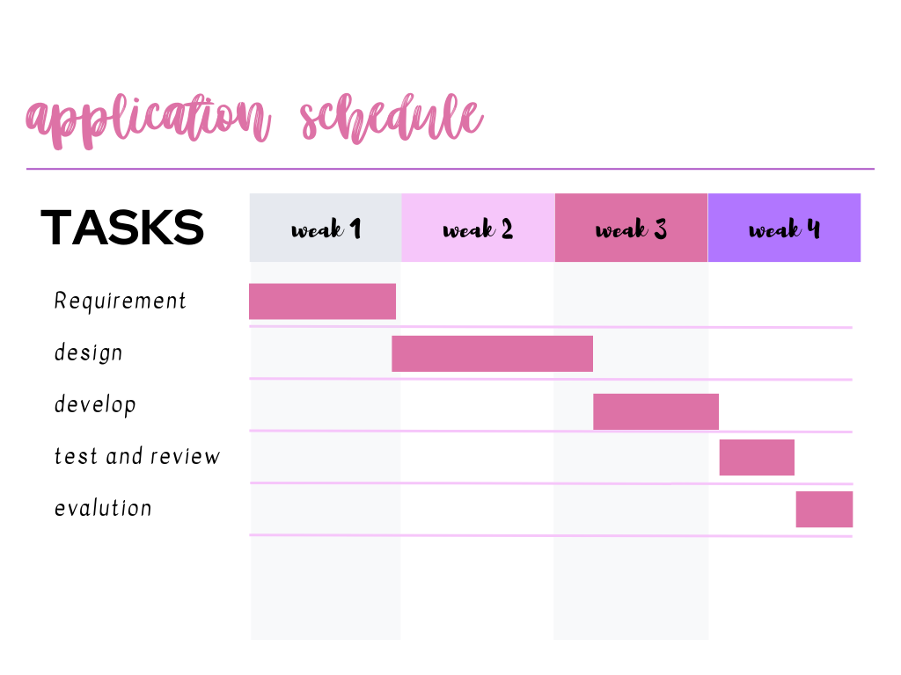
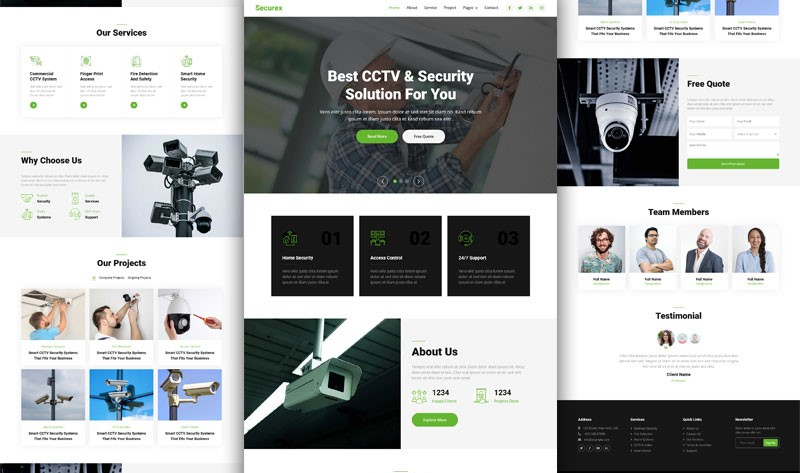

# Berimbolo Security Website

## Introduction
This project involves the creation of a modern and responsive website for Berimbolo Security, aimed at enhancing brand presence, disseminating information, engaging users, and ensuring accessibility.

## application schedule

## Objectives
- **Enhanced Brand Presence**: A visually appealing design to boost brand awareness[^1^][1].
- **Information Dissemination**: Detailed company and service information, along with security advice[^2^][2].
- **User Engagement**: Easy communication channels for customer inquiries[^3^][3].
- **Responsive Design**: Adaptive layout for various devices[^4^][4].
- **Accessibility**: Features for diverse user navigation and usage.

## Constraints
- **Time**: Completion within the specified timeline[^5^][5].
- **Budget**: Adherence to the development and maintenance budget[^6^][6].
- **Technology Compatibility**: Wide browser and device compatibility[^7^][7].
- **Compliance**: Industry standards and data privacy regulations[^8^][8].
- **Scalability**: Accommodating future growth and updates[^9^][9].

## GUI Design
The website will feature a landing page with sections for services, plans, contact form, and footer. Alternative design options and user feedback will be considered to enhance user experience.

# application ui 

## Technical Documentation
- **Product Name**: Berimbolo Security website[^10^][10]
- **Version**: 1.0.0[^11^][11]

## Technologies Used
- **HTML**: Structure of web content[^12^][12].
- **CSS**: Styling and formatting of HTML elements[^13^][13].
- **JavaScript**: Interactivity and dynamic behavior[^14^][14].
- **Bootstrap**: Responsive and mobile-first design[^15^][15].
- **Sass**: CSS preprocessor for extended capabilities[^16^][16].
- **Wow Animation Library**: Customizable animations[^17^][17].

## Conclusion
The design document reflects a user-centric approach to meet user needs through usability, accessibility, functionality, aesthetics, adaptability, and iterative feedback, ensuring an exceptional user experience[^18^][18].

